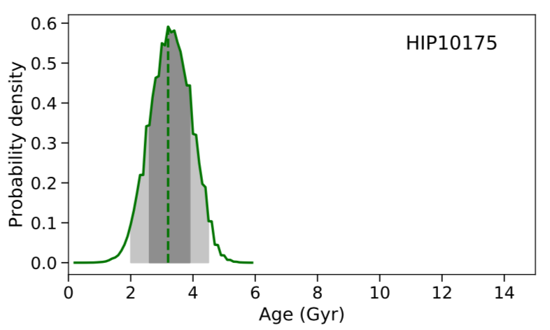

# aussieq2
**aussieq2** calculate stellar ages and massess starting from the stellar parameters (temperature, gravity, and V magnitude) and a grid of isochrones. 

This is an example of the age probability distribution calculated for the star HIP 10175

It also creades HR diagrams overplotting a det of isochrones and the stellar parameters (see this example: [HRD_plots.ipynb](https://github.com/spinastro/aussieq2/blob/master/HRD_plots.ipynb)).
